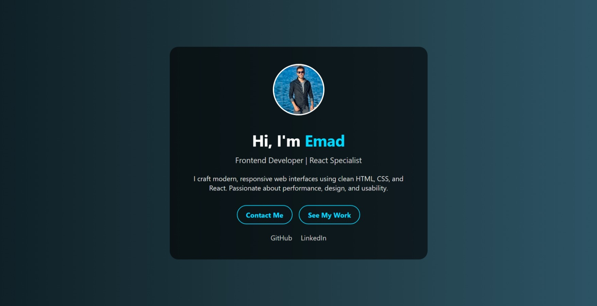
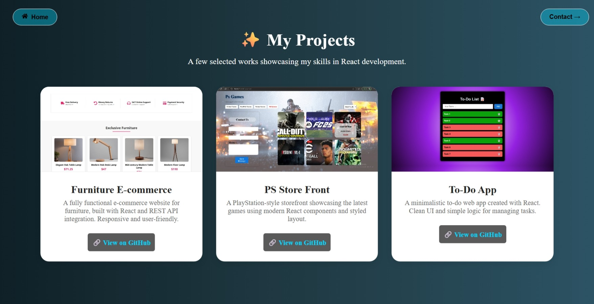
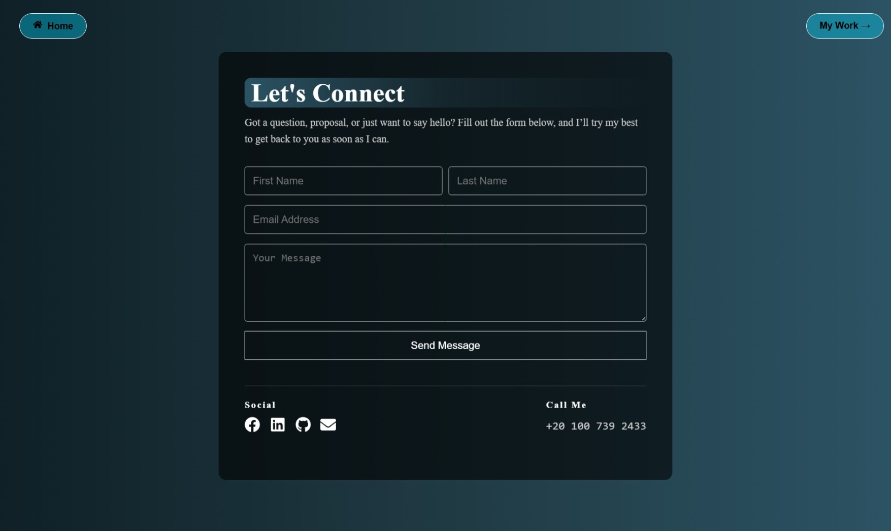

# 🌐 Simple Landing Page Portfolio

This is a clean and modern landing page built using **React**. The goal of this project is to showcase a developer's personal portfolio, including sections like:

- 🏠 Landing Page
- 💼 My Work (Projects)
- 📞 Contact Me

## 🔗 Live Demo

🚀 [View Live on GitHub Pages](https://omda-dev.github.io/Simple-Landing-Page-Portfolio-/)

## 📸 Screenshots

## 🛠️ Built With

- React.js
- React Router DOM
- CSS (custom styling)
- React Icons

## 📁 Folder Structure
